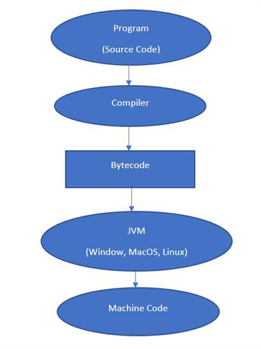

Java development involves several essential tools and concepts crucial for building powerful applications. Let's explore some key components: Maven, JAR files, the Java compiler, and more.

## What Happens in the Background

Java code undergoes several transformations before it can be executed. The Java compiler translates human-readable Java code into bytecode, a low-level intermediate language. This bytecode is then executed by the Java Virtual Machine (JVM), which translates it into machine code that can be understood by the underlying hardware.



## Java Compiler

The Java compiler plays a central role in the development process. It translates written Java code into Java bytecode, which is stored in files with a `.class` extension. These bytecode files contain instructions that the JVM can understand and execute.


- **Usage:**

```java
javac HelloWorld.java 
```

- **Purpose of the Java Compiler:**
  - Translates Java code into bytecode.
  - Bytecode is stored in `.class` files.
  - JVM translates bytecode into machine code for execution.

## JAR Files: Packaging Java Applications

### What is a JAR?

A JAR (Java Archive) file is a package file format used to aggregate many Java class files and associated metadata and resources into one file. It is similar to an internal zip file and is commonly used to distribute application software or libraries.

### Use Cases

- Deploying server applications.
- Distributing libraries for reuse in other projects.

### How to Create a JAR File

Creating a JAR file is straightforward. You can use the `jar` command provided by the JDK to package your compiled Java classes and resources into a single file. 

```java
java cvf app.jar *.class
```

### Inspecting a JAR File

You can inspect the contents of a JAR file using the `jar tvf` command, which lists the files and directories contained within the JAR. This command is similar to using `ls -a` in Linux and helps you verify the contents of your packaged application.

```java
jar tvf app.jar
```

### Creating Runnable JAR Files

A runnable JAR file contains a manifest file that specifies the main class to run. This enables you to execute the JAR file with a simple `java -jar` command. Runnable JARs are convenient for distributing standalone applications that users can run without needing to set up a complex environment

```java
java -jar app.java
```

## Maven: Simplifying Dependency Management

Maven is a powerful tool for managing Java projects and dependencies. It simplifies the process of building and managing Java applications by automating repetitive tasks and providing a standardized project structure.

### Problems Solved with Maven

Maven addresses common challenges in Java development, including:

- Dependency Management: Maven automatically downloads required libraries, eliminating the need for manual dependency management.
- Build Automation: Maven streamlines the build process, generating executable JAR files with minimal effort.

### How Maven Works

Maven follows a predefined lifecycle for building projects. Key phases include validation, compilation, testing, packaging, and more. Maven plugins extend its functionality in each phase, allowing developers to customize the build process according to their needs.

### Maven Commands

Common Maven commands include `mvn compile` for compiling code and `mvn test` for running tests. These commands automate tasks and ensure project consistency, making Maven an indispensable tool for Java developers.

### Maven Repository

Maven stores downloaded libraries in a local repository (`~/.m2/repository`). This repository serves as a cache for dependencies, making them readily available for use in other projects. Developers can also add their own libraries to this repository for easy reuse across multiple projects.

## Installation

### JDK

To install the Java Development Kit (JDK), you can use package managers like `apt` on Ubuntu or download the JDK from the official website. After installation, verify the Java version using the `java -version` command.

### MAVEN

To install Maven, download the binaries from the official website and extract them to a directory like `/opt/`. Set the `M2_HOME` and `PATH` variables to point to the Maven installation directory. After installation, verify Maven using the `mvn -version` command.